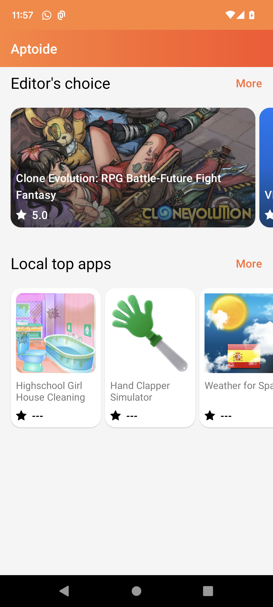
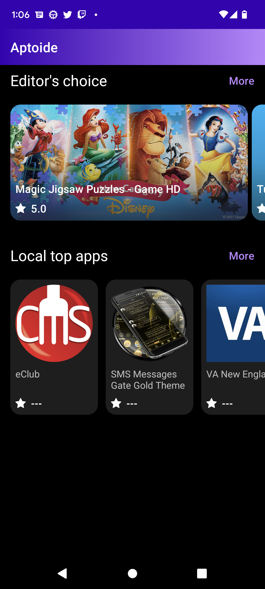
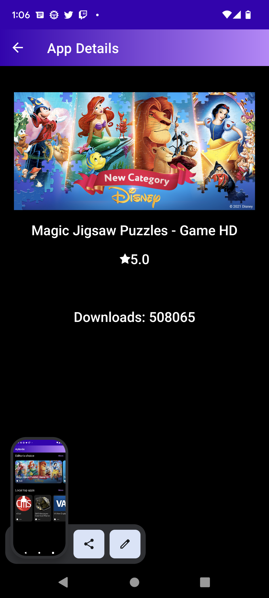

# App Store Clone
## The Brief

This is an app store clone that fetches apps from an api and displays it.

## Architecture & Libraries

```
- Clean Architecture
- MVVM
- Multi-module(ish) - The modules are represented by packages due to the size of the project
- Coil (Image Caching)
- Unit Tests
- Hilt Dependency Injection
- Use Cases
- Retrofit
- Kotlin Coroutines
- RXJava
- Material Design
- XML Layouts
- Dark Mode Support
- Navigation Component
```

### Architecture Chosing:
I chose the MVVM architecture due to it's ease of reading, implementation and co-existence with use cases and clean architecture principles. Making Fragments reactive with MVVM seems the best choice in my opinion and the best escalability even with it's flaws.

## App preview:


Image #1 | Image #2 | Image #3
:-------------------------:|:----------------------------:|:------------------------:
    |  |
